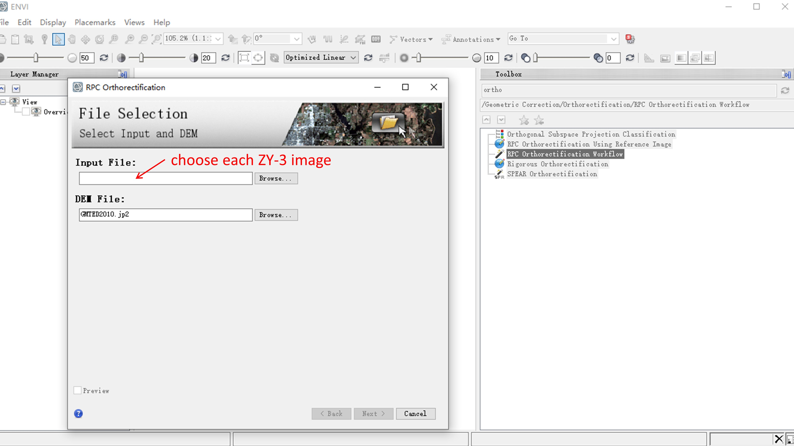
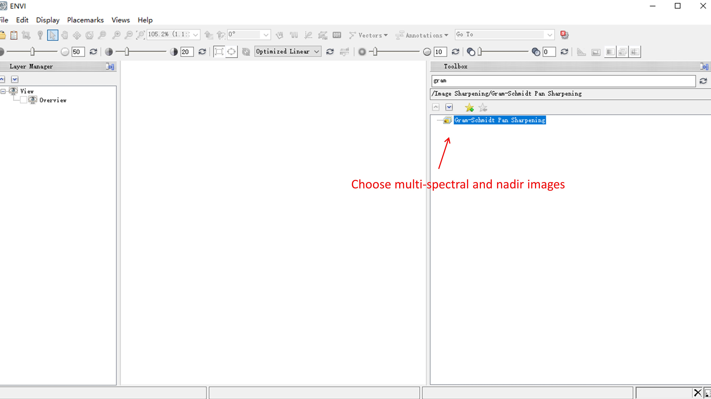
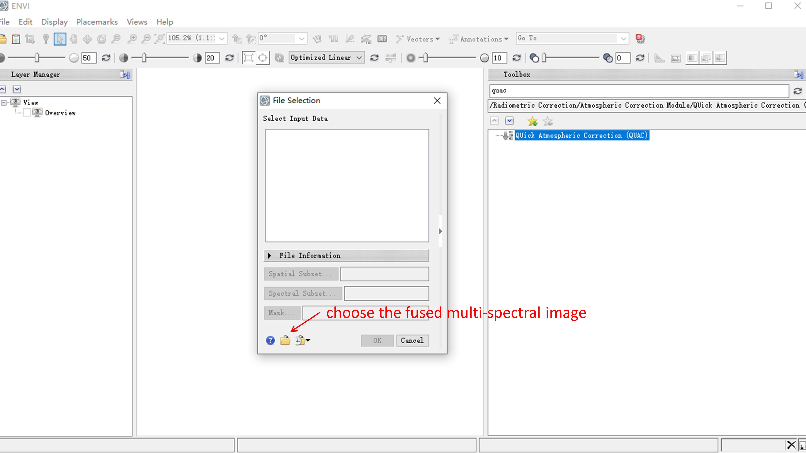

<h2 align="center">A deep learning method for building height estimation using high-resolution multi-view imagery over urban areas: A case study of 42 Chinese cities.</h2>

We introduce high-resolution ZY-3 multi-view images to estimate building height at a spatial resolution of 2.5 m. We propose a multi-spectral, multi-view, and multi-task deep network (called M3Net) for building height estimation, where ZY-3 multi-spectral and multi-view images are fused in a multi-task learning framework. By preprocessing the data from [Amap](https://amap.com) (details can be seen in the Section 2 of the paper), we obtained 4723 samples from the 42 cities (Table 1), and randomly selected 70%, 10%, and 20% of them for training, validation, and testing, respectively. Paper link ([website](https://www.sciencedirect.com/science/article/pii/S0034425721003102))

<h5 align="right">by Yinxia Cao, Xin Huang </h5>

---------------------
## Getting Started

#### Requirements:
- pytorch >= 1.8.0 (lower version can also work)
- python >=3.6

## Prepare the training set

See the sample directory. Due to the copyright problem, the whole dataset is not available publicly now.
However, the reference height data from Amap can be accessible for research use. Here is the download [link](https://pan.baidu.com/s/1bBTvZcPM6PeOXxxW3j_jOg) and extraction code is 4gn2 ). The provided data is original one, and preprocessing is needed before use.
```
for the sample directory:
  --img: the multi-spectral images with four bands (B, G, R, and NIR)
  --lab: the building height (unit: meter)
  --lab_floor: the number of floors of buildings 
  --tlc: the multi-view images with three bands (nadir, forward, and backward viewing angles)
```
Note that it is a good start to use the open ZY3 data from the ISPRS organization, see [link](https://www.isprs.org/data/zy-3/Default-HongKong-StMaxime.aspx).   
Take Hong Kong, China for example:   
   
This image can be used to test the performance of the pretrained building height model.

## Preprocess ZY-3 images
- References can be seen in https://www.cnblogs.com/enviidl/p/16541009.html      
- One-by-one steps: ortho-rectification, image-to-image registration, pan-sharpening, and radiometric correction (i.e., quick atmospheric correction (QUAC)).   
- Software: ENVI 5.3   
- The resolution of all images during each step is set to 2.5 m.   
- The detailed procedures are shown below:
#### 1. ortho-rectification
Apply the ENVI tool called `RPC orthorectification workflow` to all ZY-3 images including multi-spectral and nadir, backward, and forward images.


#### 2. image-to-image registration
Apply the ENVI tool called `Image Registration workflow` to nadir image (as reference) and other images (as warp images). 
Thus, all warp images can be registered to the reference image.


#### 3. pan-sharpening
Apply the ENVI tool called `Gram-Schmidt Pan Sharpening` to original multi-spectral and nadir images.   
Thus, the two images can be fused to generate high-resolution multi-spectral images.


#### 4. radiometric correction
Note that all original images from the data provider have been radiometrically corrected, but they still suffer from
atmospheric effects.
Thus, apply the ENVI tool called `quick atmospheric correction (QUAC)` to the fused multi-spectral images from step 3.   



## Predict the height model
#### 1. download the pretrained weights in the `run` directory.
#### 2. run the predict code and revise the path of data and weights.
```
data_path = r'sample' # the path of images 
resume = r'runs\tlcnetu_zy3bh\V1\finetune_298.tar' # the path of pretrained weights
```

```
python pred_zy3bh_tlcnetU.py         # the proposed model with two encoders for multi-spectral and multi-view images
python pred_zy3bh_tlcnetU_mux.py     # the model with one encoder for multi-spectral images
python pred_zy3bh_tlcnetU_tlc.py     # the model with one encoder for multi-view images
python pred_zy3bh_tlcnetU_tlcmux.py  # the model with one encoder for the stacking image from multi-spectral and multi-view images along the channel dimension
```
#### 3. the predicted results can be seen in the `pred.rar` 

## Train the height model
#### 1. Prepare your dataset
#### 2. edit data path
```
python train_zy3bh_tlcnetU_loss.py
```

#### 3. Evaluate on test set
see the pretrained model in directory runs/
```
python evaluate.py
```

If there is any issue, please feel free to contact me. The email adress is yinxcao@163.com or yinxcao@whu.edu.cn, and researchgate link is  https://www.researchgate.net/profile/Yinxia-Cao.

## Interesting application in Bangalore, India
update on 2022.2.26   
We directly applied the trained model in China to Bangalore, and obtained amazing results as follows.
1. Results on the Bangalore

2. Enlarged views


Note that the acquisition dates of the ZY-3 images and Google images are different, as well as their spatial resolutions,   
and therefore,there are some differences between google images and our results.  
The above results show that our method outperforms random forest method, and shows rich details of buildings.


## Citation

If you find this repo useful for your research, please consider citing the paper
```
@article{cao2021deep,
  title={A deep learning method for building height estimation using high-resolution multi-view imagery over urban areas: A case study of 42 Chinese cities},
  author={Cao, Yinxia and Huang, Xin},
  journal={Remote Sensing of Environment},
  volume={264},
  pages={112590},
  year={2021},
  publisher={Elsevier}
}
```
## Acknowledgement
Thanks for advice from the supervisor [Xin Huang](https://scholar.google.com/citations?user=TS6FzEwAAAAJ&hl=zh-CN), Doctor [Mengmeng Li](https://scholar.google.com/citations?user=TwTgEzwAAAAJ&hl=en), Professor [Xuecao Li](https://scholar.google.com.hk/citations?user=r2p47SEAAAAJ&hl=zh-CN), and anonymous reviewers.
```
@article{mshahsemseg,
    Author = {Meet P Shah},
    Title = {Semantic Segmentation Architectures Implemented in PyTorch.},
    Journal = {https://github.com/meetshah1995/pytorch-semseg},
    Year = {2017}
}
```
